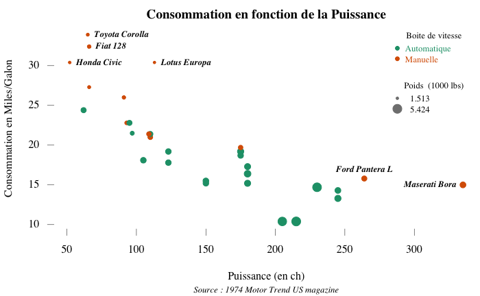
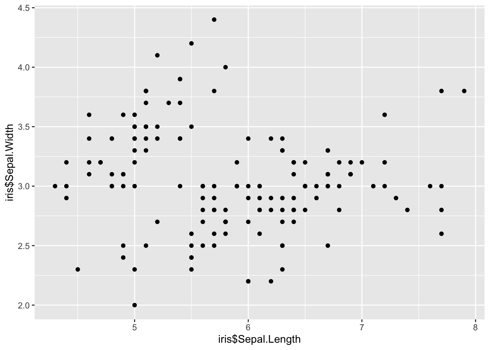

# Créer un *package* `R` par la pratique {#package}


<style type="text/css">
.red {
  color: red;
}
</style>


Le but de la visualisation de données étant de représenter graphiquement des données brutes (ou quasi-brutes), il est souvent nécessaire de prendre en compte plusieurs variables. Nous devons donc aller plus loin que les graphiques de base (nuage de points, droite de regression, boite à moustache, diagramme en barres ou circulaires, ...), pour les combiner par exemple.

Avec le langage de base (package `graphics` notamment), il est possible de faire des graphiques évolués, mais avec beaucoup de paramétrages *à la main*. Pour cela on va commencer par s'intéresser au jeu de données `mtcars`.


```r
head(mtcars)
```

```
##                    mpg cyl disp  hp drat    wt  qsec vs am gear carb
## Mazda RX4         21.0   6  160 110 3.90 2.620 16.46  0  1    4    4
## Mazda RX4 Wag     21.0   6  160 110 3.90 2.875 17.02  0  1    4    4
## Datsun 710        22.8   4  108  93 3.85 2.320 18.61  1  1    4    1
## Hornet 4 Drive    21.4   6  258 110 3.08 3.215 19.44  1  0    3    1
## Hornet Sportabout 18.7   8  360 175 3.15 3.440 17.02  0  0    3    2
## Valiant           18.1   6  225 105 2.76 3.460 20.22  1  0    3    1
```

```r
# ?mtcars ou help(mtcars)
str(mtcars)
```

```
## 'data.frame':	32 obs. of  11 variables:
##  $ mpg : num  21 21 22.8 21.4 18.7 18.1 14.3 24.4 22.8 19.2 ...
##  $ cyl : num  6 6 4 6 8 6 8 4 4 6 ...
##  $ disp: num  160 160 108 258 360 ...
##  $ hp  : num  110 110 93 110 175 105 245 62 95 123 ...
##  $ drat: num  3.9 3.9 3.85 3.08 3.15 2.76 3.21 3.69 3.92 3.92 ...
##  $ wt  : num  2.62 2.88 2.32 3.21 3.44 ...
##  $ qsec: num  16.5 17 18.6 19.4 17 ...
##  $ vs  : num  0 0 1 1 0 1 0 1 1 1 ...
##  $ am  : num  1 1 1 0 0 0 0 0 0 0 ...
##  $ gear: num  4 4 4 3 3 3 3 4 4 4 ...
##  $ carb: num  4 4 1 1 2 1 4 2 2 4 ...
```

```r
plot(mtcars$hp,mtcars$mpg)
```


Essayons d'améliorer ce graphique...
Ci dessous, un exemple de graphique avancé, représentant 4 variables (trois quantitatives et une qualitative), ainsi qu'une explication succincte des différentes fonctions utilisées, et quelques paramètres de celles-ci.  


```r
par(family = "serif", mar = c(5, 4, 2, 0)+.1)
couleurs_am = brewer.pal(3, "Dark2")
plot(mpg ~ hp, 
     data = mtcars,
     pch = 19,
     cex = wt/3,
     col = couleurs_am[mtcars$am+1],
     main = "Consommation en fonction de la Puissance",
     sub = "Source : 1974 Motor Trend US magazine", font.sub = 3, cex.sub = .8,
     xlab = "Puissance (en ch)",
     ylab = "Consommation en Miles/Galon",
     bty = "n", axes = FALSE)
axis(1, lwd = 0, lwd.ticks = .5)
at.y = axis(2, lwd = 0, lwd.ticks = .5, labels = FALSE)
text(y = at.y, x = 35, labels = at.y, srt = 0, pos = 2, xpd = TRUE)
l1 = legend("topright", legend = c("Automatique", "Manuelle"), 
       col = couleurs_am, bty = "n", cex = .8, pch = 19,
       text.width = 50, text.col = couleurs_am, 
       title = "Boite de vitesse", title.col = "black")
legend(l1$rect$left, l1$rect$top-l1$rect$h-1, 
       legend = range(mtcars$wt), title = "Poids  (1000 lbs)",
       pch = 19, pt.cex = range(mtcars$wt)/3, bty = "n", cex = .8, col = gray(.5),
       text.width = 50, adj = -.25)
outliers_hp = subset(mtcars, subset = hp > 250)
text(outliers_hp$hp, outliers_hp$mpg, row.names(outliers_hp), pos = c(3, 2), cex = .8, font = 4)
outliers_mpg = subset(mtcars, subset = mpg > 30)
text(outliers_mpg$hp, outliers_mpg$mpg, row.names(outliers_mpg), pos = 4, cex = .8, font = 4)
```
  
<center></center>  


- La fonction `par()` permet de modifier les paramètres graphiques, tel que :
    - `mar` pour les marges (un vecteur numérique de taille 4 qui permet de définir les tailles des marges dans l'ordre suivant : bas, gauche, haut, droite. Par défaut il vaut c(5.1, 4.1, 4.1, 2.1) )
    - `family` pour la famille de police d'écriture
    - certains paramètres ci-après sont définissables globalement dans la fonction `par()`, ou localement dans les fonctions suivantes
- Les paramètres de la fonction `plot()`
    - `pch` : symbole utilisé pour chaque point (ici `19` indique un rond plein)
    - `cex` : taille du point (ici en fonction de la variable `wt`)
    - `col` : couleur des points (ici en fonction de la variable  `am`)
    - `main`, `sub`, `xlab`, `ylab` : resp. titre, sous-titre, intitulé en abscisse et intitulé en ordonnée
    - `*.sub` : indication spécifique pour le sous-titre 
    - `bty` : type de la boite (ici `n` veut dire rien autour du graphique)
    - `axes` : présence ou non des axes (non ici)
- La fonction `axis()` qui permet d'ajouter un axe (`1` : en abscisse, et `2` : en ordonnée)
    - si rien d'indiqué pour `at`, utilisation des `ticks` par défaut
    - `lwd` : largeur de la ligne (ici non-présente)
    - `lwd.ticks` : largeur des ticks (assez fine ici)
    - renvoie les valeurs des ticks
- La fonction `text()` permet d'écrire du texte sur le graphique
    - le `x = 35` est choisi par expérience
    - `srt` : angle du texte
    - `pos` : ajustement du texte par rapport aux coordonnées indiquées
    - `xpd` : permet d'écrire en dehors du graphique (dans les marges donc)
- La fonction `legend()` permet d'ajouter une légende
    - position : soit $(x,y)$, soit chaine spécifique
    - `legend` : texte des items
    - `col`, `bty`, `cex`, `pch` : identique à précédemment
    - `text.width` et `text.col` : largeur du texte des items et couleur(s)
    - `title` et `title.col` : titre de la légende (et couleur du titre)
    - renvoie une liste avec deux objets (`rect` qui contient des infos sur le rectangle occupé par la légende dans le graphique et `text` qui contient les coordonnées du texte des items)
    - `pt.cex` : taille des symboles
    - `adj`: ajustement du texte
    


L'utilisateur souhaite réaliser des graphiques (nuages de points, histogrammes, densité...) et les personnaliser (légendes, titres, échelles...).

::: {.recommandation data-latex=""}
Il est recommandé d'utiliser le package ggplot2 qui permet de réaliser et de personnaliser un grand nombre de représentations graphiques;
Il est conseillé aux utilisateurs débutants d'utiliser l'add-in esquisse pour se familiariser avec ggplot2.

Vous pouvez également accéder à `esquisse` en exécutant le code suivant:


```r
library(esquisse)
esquisser()
```


L'objectif du *package* `ggplot2` est de fournir une approche unique pour produire quasiment toute représentation graphique de données. Ce _package_ propose un grand nombre de fonctions permettant de personnaliser finement les représentations graphiques. Cette fiche n'est donc qu'une introduction succincte à `ggplot2`. Pour des formations plus détaillées, se référer à {#ggplot2Ressources}.


### Introduction

**La fonction essentielle de `ggplot2` est `ggplot()`.** Il faut définir quatre éléments pour construire un graphique avec `ggplot()`: 

- la **table de données** ;
- le ***mapping*** : on définit dans l'_aesthetic_ (ou `aes`) le lien entre les variables des données et ce que l'on veut représenter sur le graphique (quelle variable sur l'axe `x`, sur l'axe `y`, quelle variable pour définir une graduation de couleurs...) ;
- la **forme géométrique ou _geometry_ ** : on définit la représentation graphique qu'on souhaite utiliser. Les géométries ont toutes un nom qui commence par `geom_`; par exemple, il faut utiliser la géométrie `geom_point()` pour réaliser un nuage de points;
- les **paramètres** : on définit les autres paramètres qui dépendent de constantes (par exemple : je veux que toutes mes lignes soient rouges ou de taille 2 pixels).

**La construction d'un graphique repose sur le principe de couches successives.** Les différentes couches graphiques se superposent et s'enchaînent grâce à l'**opérateur `+`**, comme un pipe. Il est possible d'aller à la ligne dans une instruction `ggplot()`, il suffit que l'opérateur `+` figure à la fin de la ligne.

Voici un exemple de code qui crée un nuage de points (géométrie `geom_point()`) à partir des données `mes_donnees`, avec les variables `variable1` en abscisse et `variable2` en ordonnée:

<details>
  <summary>**Se mettre d'accord sur la trame qui sera le squelette du rapport**</summary>

```r
library(ggplot2)
ggplot(data = iris) + 
  geom_point(mapping = aes(x = iris$Sepal.Length, y = iris$Sepal.Width))
```

```
## Warning: Use of `iris$Sepal.Length` is discouraged. Use `Sepal.Length` instead.
```

```
## Warning: Use of `iris$Sepal.Width` is discouraged. Use `Sepal.Width` instead.
```


</details> 


```r
library(ggplot2)
ggplot(data = iris) + 
  geom_point(mapping = aes(x = iris$Sepal.Length, y = iris$Sepal.Width))
```

### Le *mapping* et l'utilisation d'`aes()` {#mapping}

Le *mapping* désigne dans `ggplot2` la relation entre un **attribut graphique** de la `geometry` (abscisse, ordonnée, couleur...) et **une variable** présente dans la table de données. On déclare le *mapping* grâce à la fonction `aes()` (pour _aesthetic_), qui sert donc à identifier les variables que l'on souhaite représenter sur le graphique. 

**Les arguments fondamentaux de `aes()` sont les variables représentées sur l'axe des abscisses et l'axe des ordonnées (`x` et `y`).** Par exemple, on écrit `aes(x = niveau_vie_median, y = taux_chomage)` si l'on souhaite représenter pour chaque iris le taux de chômage (sur l'axe `y`) en fonction du niveau de vie médian (sur l'axe `x`).


Par ailleurs, la fonction `aes()` admet d'autres arguments qui permettent de modifier l'apparence des attributs graphiques selon une troisième variable du jeu de données. Voici les arguments supplémentaires les plus courants:

Attribut   |Description
-----------------|------------------------------------
**`color`**| Couleur des lignes ou des points
**`shape`**| Forme des points
**`size`**| Taille des points
**`alpha`**| Transparence des points
**`fill`**| Couleur des surfaces
**`linetype`**| Type de ligne (continue, pointillée, ...)


Dans l'exemple qui suit, on représente pour chaque iris le taux de chômage (sur l'axe `y`) en fonction du niveau de vie médian (sur l'axe `x`), en colorant les points en fonction de la part des cadres et professions intellectuelles supérieures parmi les actifs de l'iris (`color = part_cadres`).


Il est également possible d'utiliser ces mêmes arguments pour modifier un attribut graphique sans le lier à une variable. En ce cas, on définit l'attribut **à l'extérieur de l'_aesthetic_** (donc à l'extérieur de `aes()`). Voici l'exemple précédent, modifié pour que tous les points soient (rouge), et non en fonction d'une variable. L'argument `color` est donc à l'extérieur de `aes()`.


::: {.remarque data-latex=""}
La notion de *mapping* et la définition des attributs graphiques à l'intérieur et à l'extérieur d'`aes()` sont une des principales difficultés de `ggplot2`. Il est normal de tâtonner lorsqu'on commence à les utiliser. Pour s'y retrouver, il suffit de suivre la règle suivante. **Si on établit un lien entre les valeurs d’une variable et un attribut graphique, il s'agit d'un _mapping_ qui doit être défini à _l'intérieur_ de la fonction `aes()`. Dans le cas contraire, il s'agit d'un simple paramètre du graphique, qui doit être défini à _l'extérieur_ de la fonction `aes()`.**
:::

### Les formes géométriques

La forme géométrique ou _geometry_ désigne le type de représentation graphique utilisée (nuage de points, histogrammes...). On spécifie le type de représentation que l'on souhait en utilisant une fonction dont le nom commence par **`geom_`**. Le tableau ci-dessous présente quelques représentations graphiques classiques. 

_geometry_         | Description              | Arguments 
-------------------|--------------------------|------------------------------------
`geom_point()`     |	Nuage de points 	      | `x`, `y`, `shape`, `fill`, `size`
`geom_line()`	     | Ligne                    | `x`, `y`, `linetype`
`geom_bar()`       |	Diagramme en barres 	  | `x`, `fill`, `linetype`, `weight`
`geom_histogram()` |	Histogramme 	          | `x`, `fill`, `linetype`, `weight`
`geom_boxplot()`	 | Boîte à moustaches 	    | `x`, `y`, `fill`, `weight`
`geom_density()`	 | Courbe de densité        |	`x`, `y`, `fill`, `color`, `linetype`

Voici deux exemples d'utilisation.


::: {.remarque data-latex=""}
Il existe un grand nombre de géométries dans `ggplot2`. Vous pouvez en afficher la liste en exécutant la commande `help.search("^geom_", package = "ggplot2")`.

Par ailleurs, de très nombreux *packages* proposent encore d'autres géométries pour réaliser des représentations graphiques particulières (cartes avec `ggmap`, arbres généalogiques avec `ggtree` et `ggenealogy`, résultats d'élections avec `ggparliament`...).
:::


### Combiner plusieurs formes géométriques

On peut représenter plusieurs formes géométriques simultanément sur un même graphique (un nuage de points et une droite de régression par exemple). il suffit de les ajouter les unes aux autres avec l’opérateur `+`. Voici un exemple:


::: {.remarque data-latex=""}
Il peut arriver qu'on définisse le même _mapping_ dans plusieurs formes géométriques, c'est-à-dire qu'on utilise les mêmes relations entre les variables et les attributs graphiques dans des formes géométriques différents (exemple: les variables `x` et `y` sont les mêmes dans un nuage de points et dans la droite de régression). Dans ce cas, il est possible de déclarer le _mapping_ directmement dans l’appel à `ggplot()` plutôt que de le répéter dans chaque forme géométrique. Le _mapping_ sera alors valable pour toutes les formes géométriques du graphique (sauf si celles-ci redéfinissent explicitement le _mapping_). Le code suivant produit exactement le même graphique que l'exemple précédent:


```r
ggplot(data_iris_paris2017, aes(x = niveau_vie_median, y = taux_chomage)) + 
  geom_point(alpha = 0.2) + 
  geom_smooth(method = "lm")
```
:::


### Créer un graphique par modalité d'une variable

La fonction `facet_wrap()` permet de représenter des données *en facettes*, c'est-à-dire décomposées par une variable de croisement. Chaque modalité de la variable catégorielle servira à découper les données pour générer un graphique. Par défaut, les échelles des axes $x$ et $y$ sont identiques mais il est possible de les distinguer avec le paramètre `scales` (qui prend la valeur `"free_x"` pour libérer l'axe des abscisses, `"free_y"` pour l'axe des ordonnées ou `"free"` pour les deux axes). Les arguments optionnels `nrow` et `ncol` permettent de contrôler le nombre lignes et de colonnes. Voici un exemple sur les iris parisiens:


## Comment personnaliser un graphique

Il est possible de personnaliser un graphique `ggplot2` de deux façons:

- en modifiant les options une à une (titres du graphique et des axes, graduation des axe...);
- en utilisant un `theme` prédéfini ou en le définissant soi-même.

Avec `ggplot`, il est possible d'aboutir au même résultat avec plusieurs instructions, en particulier lorsqu'il est question de customisation du thème. Il ne faut ainsi pas hésiter à chercher une solution sur le site [StackOverflow](https://stackoverflow.com/questions/tagged/ggplot2?sort=faq).

### Les options des graphiques

Les graphiques réalisés avec `ggplot2` peuvent être personnalisés finement. Chaque nouvel élément graphique est à rajouter à l'objet `ggplot` avec l’opérateur `+`.

#### Définir les titres du graphique et des axes

La fonction `labs()` permet de définir les titres: le titre général du graphique (`title`), le sous-titre (`subtitle`), la note de bas de graphique (`caption`), les axes (`x`, `y`)... Il existe d'autres façons de définir les titres (`ggtitle`, `xlab`, `ylab`).


#### Utilisation des _scales_

Les fonctions _scales_ dans `ggplot2` permettent de modifier la manière dont un attribut graphique est relié aux valeurs d’une variable, et dont la légende correspondante va être affichée. L'utilisation des _scales_ permet de définir facilement un grand nombre d'options. Par exemple, pour les attributs `x` et `y`, on peut définir la nature des variables (discrètes ou continues), les graduations, l'unité des étiquettes (pourcentage, euros...), et pour l'attribut `color` on peut contrôler la palette de couleur utilisée. 

Pour modifier une _scale_ existante, on ajoute à l'objet `ggplot`  un élément qui prend la forme `scale_<attribut>_<échelle>`. Les attributs sont listés dans le tableau de la section  \@ref(mapping) (`size`, `color`, `fill`...). Les échelle sont listées dans le tableau suivant:

Paramétrage|Description
-----------------|--------------------------
continuous|gérer les variables continues
discrete|gérer les variables discrètes
date|gérer une variable au format date
reverse|inverser l'axe
log|convertir l'échelle d'une variable continue en échelle logarithmique
log10|convertir l'échelle d'une variable continue en échelle logarithmique décimale
viridis|utiliser une palette de couleur viridis
brewer|utiliser une palette de couleur brewer (variable discrète)
distiller|utiliser une palette de couleur brewer (variable continue)
gradient|utiliser un gradient de 2 couleurs
gradient2|utiliser un gradient divergent de 3 couleurs

::: {.conseil data-latex=""}
Le _package_ `scales` est très utile pour mettre en forme les étiquettes des échelles (pourcentage, euro, dollar...) et est développé par les auteurs de `ggplot2`. Il est vivement conseillé de l'utiliser lorsqu'on veut produire des graphiques pour une publication.
:::

Dans l'exemple suivant, on utilise deux _scales_:

* la fonction `scale_x_log10()` pour mettre en forme l'axe des abscisses: les valeurs sont représentées selon une échelle logarithmique, qui va de 10 000 à 70 000 euros, avec une graduation tous les 10 000 euros;
* la fonction `scale_y_continuous()` pour mettre en forme l'axe des ordonnées: l'axe va  de 0 à 0.3, les étiquettes sont exprimées en pourcentage et on gradue tous les 5 points.


#### Modifier les échelles de couleur

Un cas particulier de la section précédente porte sur les échelles de couleur, utilisés principalement avec les attributs `color` (pour la couleur des points ou des courbes) et `fill` (pour le remplissage des barres dans un histogramme). Il existe un grand nombre d'échelles de couleur, utilisables avec les fonctions `scale_color_<paramétrage>` et `scale_fill_<paramétrage>`:

* `scale_color_brewer` et `scale_fill_brewer` permettent d'utiliser les nombreuses échelles de couleur du _package_ `RColorBrewer` (plus d'informations [ici](http://www.sthda.com/french/wiki/couleurs-dans-r#utilisation-des-palettes-de-couleurs-rcolorbrewer));
* `scale_color_grey` et `scale_fill_grey` permettent d'utiliser des échelles de gris;
* `scale_color_gradient` et `scale_fill_gradient` permettent d'utiliser des gradients de couleur personnalisés;
* `scale_color_viridis` et `scale_fill_viridis` permettent d'utiliser les échelles de couleur du _package_ `viridis`. Ces échelles de couleur présentent deux grands avantages: elles conviennent aux daltoniens et restent lisibles lorsque le graphique est imprimé en noir et blanc (plus d'informations sur `viridis` dans [cette vignette](https://cran.r-project.org/web/packages/viridis/vignettes/intro-to-viridis.html)).

Voici un exemple avec le graphique précédent, dans lequel on indique que la variable représentée sur l'axe des ordonnées est exprimée en pourcentage, de même que la variable indiquant la couleur des points. On choisit par ailleurs une autre échelle de couleur.


#### Modifier la légende

Les fonctions `guide()` et `guides()` permettent de modifier finement la légende. Les guides peuvent être spécifiés dans chaque _scale_ ou dans une instruction `guides()`. Voici un exemple:


### Utiliser un thème

#### Utiliser un thème existant

Lorsqu'on veut donner une apparence homogène à un grand nombre de graphiques, il est préférable de définir un thème plutôt que de personnaliser tous les graphiques avec des options identiques. Il existe dans `ggplot2` des [thèmes prédéfinis](http://ggplot2.tidyverse.org/reference/index.html#section-themes) que l'on peut utiliser facilement. Par exemple : `theme_minimal()`, `theme_classic()`, `theme_bw()`, `theme_dark()`... Des *packages* externes permettent d'enrichir cette collection de thèmes, par exemple `ggthemes` ou `hrbrthemes`.

Pour utiliser un thème prédéfini, il suffit d'utiliser la fonction `theme_set()`comme ceci:


```r
theme_set(theme_minimal())
```

#### Définir un thème personnalisé

La fonction **`theme()`** permet de créer des templates, c'est-à-dire de définir tout ce qui n'est pas lié directement aux données sur un graphique, notamment la position, la taille, la couleur et la police des éléments textuels (légende, titres du graphique et des axes), ainsi que la couleur des grilles primaires et secondaires du graphique. La définition d'un thème personnalisé dépasse largement le cadre de la présente fiche, mais doit vous intéresser si vous devez produire des graphiques avec une apparence homogène. Voici quelques références pour les utilisateurs intéressés:

- une [introduction en français](https://mtes-mct.github.io/parcours-r/m5/les-th%C3%A8mes.html) à la définition des thèmes;
- le [chapitre 9 de *R Graphics Cookbook*](https://r-graphics.org/chapter-appearance) (en anglais) aborde la question des thèmes;
- l'[*addin* RStudio `ggThemeAssist`](https://calligross.github.io/2016-03-28-ggthemeassist-an-add-in-for-rstudio.html) est très utile pour se familiariser avec tous les éléments personnalisables des thèmes.

## Exporter un graphique

La fonction `ggsave()` de `ggplot2` permet d'exporter des graphiques dans un fichier externe. Les formats recommandés sont le `pdf`  et le `png`. Il est néanmoins possible d'utiliser d'autres formats: `eps`, `ps`, `jpeg`, `tiff`, `bmp`, `svg`... Les options `width` et `height` contrôlent la taille du graphique. Attention, par défaut, ces paramètres correspondent à la taille de la fenêtre graphique de `R`, en bas à droite. Il est probable que les valeurs par défaut de ces paramètres ne vous conviennent pas, voire modifient le message de votre graphique ; n'hésitez pas à leur donner des valeurs adaptées.

Voici un exemple:


```r
p <- ggplot(data_iris_paris2017) +
  geom_point(aes(x = niveau_vie_median, y = taux_chomage, color = part_cadres)) +
  labs(title="Taux de chômage par iris à Paris en fonction du niveau de vie médian",
       x="Taux de chômage",
       y="Niveau de vie médian",
       color = "Part de cadres parmi les actifs",
       caption="Sources : Filosofi 2017, RP 2017")
ggsave("dossier/export/graphiques/graphique_iris_paris.pdf", p, width=12, height = 5)
```


## Pour en savoir plus {#ggplot2Ressources}

* [La documentation officielle](http://ggplot2.tidyverse.org/index.html) (en anglais) de `ggplot2` est très complète et accessible en ligne.
* Une "antisèche" (en français) résumant en deux pages l'ensemble des fonctions et arguments et disponible [ici](https://thinkr.fr/pdf/ggplot2-french-cheatsheet.pdf).
* Les parties [Data visualisation](http://r4ds.had.co.nz/data-visualisation.html) et [Graphics for communication](http://r4ds.had.co.nz/graphics-for-communication.html) de l'ouvrage en ligne *R for data science*, de Hadley Wickham, sont une très bonne introduction à `ggplot2`.
* [Partie `ggplot2`](https://juba.github.io/tidyverse/08-ggplot2.html) de l'introduction à `R` et au `tidyverse`;
* [Partie `ggplot2`](https://mtes-mct.github.io/parcours-r/m5/package-ggplot2.html) de la formation à `R` du Ministère de la Transition écologique et solidaire.
* Plusieurs ouvrages, toujours en anglais, abordent en détail l'utilisation de `ggplot2`:
    - [ggplot2: Elegant Graphics for Data Analysis](http://www.amazon.fr/ggplot2-Elegant-Graphics-Data-Analysis/dp/0387981403/) de Hadley Wickham;
    - [*R Graphics Cookbook*](http://www.amazon.fr/R-Graphics-Cookbook-Winston-Chang/dp/1449316956) de Winston Chang. Le [site associé](https://r-graphics.org/) à ce dernier ouvrage comporte aussi pas mal d'exemples et d'informations intéressantes.

Enfin, si `ggplot2` présente déjà un très grand nombre de fonctionnalités, il existe aussi un système d'extensions permettant d'ajouter des `geom`, des thèmes, etc. Le site [ggplot2 extensions](http://exts.ggplot2.tidyverse.org/) est une très bonne ressource pour les parcourir et les découvrir, notamment grâce à sa [galerie](http://exts.ggplot2.tidyverse.org/).

#### Contrôle de conformité {#check .unnumbered}

Un *package* doit répondre à un ensemble de **normes**. L'objectif de la formation n'est pas d'apprendre l'ensemble de ces normes qui sont décrites dans le manuel officiel de `R` [_Writing `R` Extensions_ ](https://cran.r-project.org/doc/manuals/r-release/R-exts.html).^[vous pouvez y accéder directement depuis `R` en exécutant `RShowDoc("R-exts")`.] 

En effet, nous utiliserons un ensemble d'outils (principalement les *packages* **devtools** et **usethis**) qui nous permettront de gérer correctement la création d'un *package*. Cependant, nous contrôlerons en permanence que notre *package* est conforme aux normes attendues par `R` en effectuant **des contrôles de conformité**.

Dans le jargon `R`, un contrôle de conformité s'appelle un **check**. Cette étape est **fondamentale**. **Vous ne devrez jamais la négliger.**

Il s'agit de passer une batterie de contrôles pour voir si les modifications que vous opérez à votre *package* sont conformes :

- aux normes exigées par `R`;
- aux tests que vous aurez vous-mêmes définis.

Il s'agit de l'action que vous réaliserez le plus fréquemment. Si vous négligiez de le faire, vous pourriez à terme vous retrouver dans des situations très délicates. Il y a trois façons de réaliser ce contrôle de conformité :

- dans l'onglet _Build_, cliquer sur le bouton _Check_;
- utiliser le raccourci clavier `Ctrl+Shift+E`;
- dans la console de R, exécuter :
  ```r
  devtools::check()
  ```

**Il s'agit de l'étape la plus importante**.\
Notez-là dès maintenant, car vous allez l'utiliser très souvent.

### Feuille de route pour créer un *package* {-}

Comme la création de *package* est une pratique très courante, il existe des *packages* pour nous assister dans la création de *packages*... Nous pourrions évidemment tout créer à la main, mais cela ne présente pas d'intérêt particulier à part celui de nous faire perdre du temps avec des tâches à faible valeur ajoutée.

Voici la feuille de route pour créer un *package* :


```r
# 1. Initier un package -------------------------------------
# Étapes à ne faire qu'une seule fois

# 1.a. Choisir un nom
nom <- "monpetitpaquet"
available::available(nom, browse = FALSE)

# 1.b. Créer un projet RStudio de type "package"
usethis::create_package(file.path("~", nom))

# 1.c. Renseigner les méta-données du package
# Titre du package
desc::desc_set(
  Title = "Mon Premier Paquet"
)
# Désigner les auteurs, contributeurs et 
# les détenteurs des droits de propriété intellectuelle
desc::desc_set_authors(c(
  person(
    "Mon prénom", 
    "Mon nom", 
    role = c("aut", "cre"), 
    email = "monprenom.monnom@insee.fr"
  ),
  person(
    family = "Institut national de la statistique et des études économiques", 
    role = "cph"
  )
))
# Décrire ce que fait le package
desc::desc_set(
  Description = "J'ai créé ce package pour apprendre. Ne l'installez pas il ne fait rien d'intéressant pour l'instant."
)
# Choisir une licence 
usethis::use_mit_license(
  name = "Institut national de la statistique et des études économiques (Insee)"
)
# Si la documentation du package est en français
desc::desc_set(Language = "fr")

# 2. Configurer les outils de développement -----------------
# Étapes à ne faire qu'une seule fois

# 2.a. Créer un dépôt vide dans GitLab
# il est possible d'automatiser cette étape, voir le support de formation

# 2.b. Utiliser git dans le projet RStudio
usethis::use_git()

# 2.c. Créer le lien entre le dépôt GitLab 
# et le projet RStudio
repo_url <- "https://gitlab.com/RLesur/monpetitpaquet.git"
usethis::use_git_remote(url = repo_url)
git2r::push(name = "origin", 
            refspec = "refs/heads/master", 
            set_upstream = TRUE
)

# 2.d. Utiliser testthat pour les tests
usethis::use_testthat()

# 2.e. Utiliser l'intégration continue de GitLab
usethis::use_gitlab_ci()

# 2.f. Pour utiliser markdown dans la documentation
usethis::use_roxygen_md()
roxygen2md::roxygen2md()

# 3. Développer un package ----------------------------------
# 3.a. Inclure du code, le documenter et le tester
# Pour chaque fonction du package :
usethis::use_r("mafonction")
usethis::use_test("mafonction")
# écrire le code de la fonction
# documenter la fonction
# Actualiser le NAMESPACE et la documentation
devtools::document()
# écrire les tests
# exécuter les tests
devtools::test()

# 3.b. Si besoin, déclarer une dépendance
usethis::use_package("dplyr", min_version = "0.8")
# pour utiliser %>% dans un package
usethis::use_pipe()

# 3.c. Astuce qui peut aider durant le développement
# Charger l'ensemble des fonctions de son package
devtools::load_all()

# 3.d. Assurer la conformité du package
# Réaliser le contrôle de conformité
devtools::check()

# 4. Installer le package -----------------------------------
# 4.a. Sur sa machine
devtools::install()

# 4.b. Générer le fichier compressé
devtools::build()

# 5. Documenter un package ----------------------------------
# 5.a. Créer un README (obligatoire)
usethis::use_readme_rmd() # ou bien usethis::use_readme_md()

# 5.b. Créer une vignette (fortement recommandé)
usethis::use_vignette(nom)
# Ecrire au moins une vignette qui explique 
# comment on utilise le package
# Pour construire les vignettes
devtools::build_vignettes()

# 6. Si besoin, créer un modèle de rapport R Markdown -------
usethis::use_rmarkdown_template("note mensuelle")
# éditer le fichier 
# inst/rmarkdown/templates/note-mensuelle/skeleton/skeleton.Rmd

# 7. Bonnes pratiques ---------------------------------------
# 7.a Créer un changelog (à ne faire qu'une fois)
usethis::use_news_md()
# 7.b. Gérer les versions
usethis::use_version("dev")

# 7.c. Améliorer les tests et la couverture de code
# Si vous avez bien effectué l'étape 2.e, 
# le rapport de couverture de code est disponible 
# dans GitLab Pages
# Viser une couverture de code de 100%
```

#### Démonstration par les formateurs : créer un *package* en moins de 10 minutes {-}

Afin de démystifier la création de *package*, nous demandons aux formateurs de réaliser une première démonstration devant les stagiaires. Cette démonstration doit prendre le moins de temps possible, entre 5 et 10 minutes.

Vous utiliserez le déroulé précédent (voir ci-dessus). Effectuez les étapes 1 à 4.a suivies de l'étape 6.a (vous adapterez l'url du serveur GitLab et éventuellement le nom du *package*). Vous créerez une fonction simple de votre choix et écrirez également un test. Vous pouvez utiliser l'interface RStudio pour réaliser certaines étapes plus aisément si vous le souhaitez. Mais l'objectif est de réaliser rapidement un *package* avec une fonction documentée.

Une fois le *package* installé, vous exécuterez la fonction créée et montrerez la page d'aide de la fonction.

Vous pousserez également votre travail sur GitLab et montrerez le rapport de couverture de code accessible sur GitLab Pages.

#### Comment lire ce document ? {-}

Le document détaille chaque étape de la feuille de route. Vous pouvez le lire dans l'ordre successif où aller directement à la partie qui vous intéresse. 

L'objectif de la formation n'est pas de dispenser toutes les informations comprises dans ce document (cela ferait trop). Ce document est une aide pour les formateurs et les stagiaires pour trouver des réponses à des questions qui se posent en pratique.

#### Exercice pratique {-}

TODO : à définir

Une idée (à discuter dans le groupe de conception) serait d'intégrer le travail fait en RMarkdown dans un template puis de basculer certaines fonctions dans le code source du *package*. 

## Initier un *package*

### Choisir un nom

C'est sans doute l'étape la plus délicate. **Il faut trouver un nouveau nom de *package* qui est disponible**. En effet, si vous aviez l'idée de créer un nouveau *package* avec le nom `dplyr` et que vous l'installiez, vous écraseriez le *package* `dplyr` que vous utilisez régulièrement.

Sachant qu'il existe plusieurs milliers de *packages* sur le CRAN, Bioconductor^[Bioconductor est un registre de *packages* essentiellement dédiés à la bioinformatique. Il est très populaire dans ce domaine. Le CRAN et Bioconductor sont deux registres "officiels" qui présentent bien plus de garanties que GitHub.] et GitHub, cette vérification pourrait être fastidieuse. Cependant, Jim Hester a créé le *package* **available** pour vous assister dans cette vérification. 

Les principales fonctions du *package* **available** sont `available_on_cran()`, `available_on_bioc()` et `available_on_github()`. Par exemple, pour vérifier si le nom de *package* `dplyr` est disponible, exécutez :


```r
available::available_on_cran('dplyr')
```

```
## Available on CRAN: ✖
```

```r
available::available_on_bioc('dplyr')
```

```
## Available on Bioconductor: ✔
```

```r
available::available_on_github('dplyr')
```

```
## Available on GitHub:  ✖
```

Vous ne devez **jamais choisir** comme nom de *package* un nom qui est déjà utilisé sur le **CRAN**.

Si votre *package* a vocation à être rendu public, vous ne devez **jamais choisir** un nom de *package* qui ne serait pas disponible sur **Bioconductor**. Dans le cas d'un *package* interne à l'Insee, cela n'est pas recommandé non plus (les *packages* de Bioconductor étant principalement dédié à la bioinformatique, il est cependant peu probable que cela pose un problème au sein de l'Insee).   

Si vous constatez que le nom n'est pas disponible sur GitHub, il est préférable également de trouver un autre nom pour éviter toute difficulté aux utilisateurs qui souhaiteraient tester votre *package* ainsi que l'autre en cours de développement.

Vous pouvez obtenir les adresses des projets ayant un nom identique ou proche sur GitHub de la façon suivante :

```r
res <- available::available_on_github('dplyr')
res$close[[1]]$url
```

```
## [1] "https://github.com/YTLogos/dplyr"      
## [2] "https://github.com/hadley/dplyr"       
## [3] "https://github.com/tidyverse/dplyr"    
## [4] "https://github.com/akgold/dply2"       
## [5] "https://github.com/asardaes/dtplyr"    
## [6] "https://github.com/epix-project/dplyrx"
```

Imaginons que nous envisagions d'appeler notre *package* `monpetitpaquet`. Vérifiez que le nom est bien disponible.


```r
available::available_on_cran('monpetitpaquet')
```

```
## Available on CRAN: ✔
```

```r
available::available_on_bioc('monpetitpaquet')
```

```
## Available on Bioconductor: ✔
```

```r
available::available_on_github('monpetitpaquet')
```

```
## Available on GitHub:  ✔
```

#### Pour aller plus loin {-}

TODO Préciser les règles de nommage (caractères autorisés) et les recommandations (minuscules, pas de point).  
Extrait de la documentation de `R` :  

> This should contain only (ASCII) letters, numbers and dot, have at least two characters and start with a letter and not end in a dot.

### Créer un projet RStudio de type "package"

Nous allons créer le projet à la racine de votre répertoire personnel (`~`).  
Evidemment, vous pouvez le créer à un autre emplacement mais celui-ci est généralement sans risque.  
Si nous voulons créer un *package* s'appelant `monpetitpaquet`, nous allons exécuter :


```r
usethis::create_package(file.path("~" , "monpetitpaquet"))
```

Un message de ce type va apparaître :

```
✔ Creating '/home/romain/monpetitpaquet/'
✔ Setting active project to '/home/romain/monpetitpaquet'
✔ Creating 'R/'
✔ Writing 'DESCRIPTION'
Package: monpetitpaquet
Title: What the Package Does (One Line, Title Case)
Version: 0.0.0.9000
Authors@R (parsed):
    * First Last <first.last@example.com> [aut, cre] (<https://orcid.org/YOUR-ORCID-ID>)
Description: What the package does (one paragraph).
License: What license it uses
Encoding: UTF-8
LazyData: true
✔ Writing 'NAMESPACE'
✔ Writing 'monpetitpaquet.Rproj'
✔ Adding '.Rproj.user' to '.gitignore'
✔ Adding '^monpetitpaquet\\.Rproj$', '^\\.Rproj\\.user$' to '.Rbuildignore'
✔ Opening '/home/romain/monpetitpaquet/' in new RStudio session
✔ Setting active project to '<no active project>'
```

Vous devriez voir RStudio ouvrir le projet `monpetitpaquet`.

**Ca y est, vous avez créé la structure de votre *package***.

Comme vous le voyez, ce n'était pas très compliqué...

#### Contrôle de conformité {-}

Le contrôle de conformité doit devenir une habitude. Vous devez effectuer ce contrôle après chaque modification substantielle. Nous allons donc effectuer un premier contrôle de conformité de notre *package*. Si besoin, [relisez ce qu'est un contrôle de conformité](#check).

```r
devtools::check()
```


```
## Updating monpetitpaquet documentation
## Loading monpetitpaquet
## Setting env vars ---------------------------------------------------------------------------------------------------------------
## CFLAGS  : -Wall -pedantic
## CXXFLAGS: -Wall -pedantic
## Building monpetitpaquet --------------------------------------------------------------------------------------------------------
## '/usr/lib/R/bin/R' --no-site-file --no-environ --no-save --no-restore --quiet CMD build '/home/romain/monpetitpaquet'  
##   --no-resave-data --no-manual 
## 
## * checking for file ‘/home/romain/monpetitpaquet/DESCRIPTION’ ... OK
## * preparing ‘monpetitpaquet’:
## * checking DESCRIPTION meta-information ... OK
## * checking for LF line-endings in source and make files and shell scripts
## * checking for empty or unneeded directories
## Removed empty directory ‘monpetitpaquet/R’
## Removed empty directory ‘monpetitpaquet/man’
## * building ‘monpetitpaquet_0.0.0.9000.tar.gz’
## 
## Setting env vars ---------------------------------------------------------------------------------------------------------------
## _R_CHECK_CRAN_INCOMING_USE_ASPELL_: TRUE
## _R_CHECK_CRAN_INCOMING_           : FALSE
## _R_CHECK_FORCE_SUGGESTS_          : FALSE
## Checking monpetitpaquet --------------------------------------------------------------------------------------------------------
## '/usr/lib/R/bin/R' --no-site-file --no-environ --no-save --no-restore --quiet CMD check  
##   '/tmp/Rtmp49wyMM/monpetitpaquet_0.0.0.9000.tar.gz' --as-cran --timings --no-manual 
## 
## * using log directory ‘/tmp/Rtmp49wyMM/monpetitpaquet.Rcheck’
## * using R version 3.4.4 (2018-03-15)
## * using platform: x86_64-pc-linux-gnu (64-bit)
## * using session charset: UTF-8
## * using options ‘--no-manual --as-cran’
## * checking for file ‘monpetitpaquet/DESCRIPTION’ ... OK
## * this is package ‘monpetitpaquet’ version ‘0.0.0.9000’
## * package encoding: UTF-8
## * checking package namespace information ... OK
## * checking package dependencies ... OK
## * checking if this is a source package ... OK
## * checking if there is a namespace ... OK
## * checking for executable files ... OK
## * checking for hidden files and directories ... OK
## * checking for portable file names ... OK
## * checking for sufficient/correct file permissions ... OK
## * checking whether package ‘monpetitpaquet’ can be installed ... OK
## * checking installed package size ... OK
## * checking package directory ... OK
## * checking DESCRIPTION meta-information ... WARNING
## Non-standard license specification:
##   What license it uses
## Standardizable: FALSE
## * checking top-level files ... OK
## * checking for left-over files ... OK
## * checking index information ... OK
## * checking package subdirectories ... OK
## * checking whether the package can be loaded ... OK
## * checking whether the package can be loaded with stated dependencies ... OK
## * checking whether the package can be unloaded cleanly ... OK
## * checking whether the namespace can be loaded with stated dependencies ... OK
## * checking whether the namespace can be unloaded cleanly ... OK
## * checking loading without being on the library search path ... OK
## * checking examples ... NONE
## * DONE
## 
## Status: 1 WARNING
## See
##   ‘/tmp/Rtmp49wyMM/monpetitpaquet.Rcheck/00check.log’
## for details.
## 
## 
## R CMD check results
## 0 errors | 1 warning  | 0 notes
## checking DESCRIPTION meta-information ... WARNING
## Non-standard license specification:
##   What license it uses
## Standardizable: FALSE
```

La longueur de ce rapport peut paraître assez effrayante au premier abord (surtout pour une action que vous allez répéter très fréquemment). Il n'est pas si complexe à lire si on commence par la fin (la synthèse) :

```
R CMD check results
0 errors | 1 warning  | 0 notes
checking DESCRIPTION meta-information ... WARNING
Non-standard license specification:
  What license it uses
Standardizable: FALSE
```

La ligne la plus importante est la suivante :

```
0 errors | 1 warning  | 0 notes
```

Lorsque vous avez 0 erreur, 0 avertissement et 0 note, c'est bon, vous pouvez continuer de travailler.

Sinon, il va falloir résoudre ces problèmes. **Ne remettez jamais à plus tard la résolution des erreurs, warnings et notes.**

Dans notre cas, nous n'avons rien fait et nous avons déjà un avertissement. Cela pourrait paraître très étrange. Cependant, il nous suffit de lire la nature du warning :

```
checking DESCRIPTION meta-information ... WARNING
Non-standard license specification:
  What license it uses
```

L'avertissement que nous obtenons concerne la licence de notre *package*, méta-donnée déclarée dans un fichier qui se nomme `DESCRIPTION` et qui se trouve à la racine de notre projet.

Nous allons aborder dans la partie suivante le contenu de ce fichier.

### Renseigner les méta-données du *package* : le fichier `DESCRIPTION`

Un *package* comprend un certain nombre de méta-données. Celles-ci sont fondamentales. Elles sont toutes précisées dans un fichier nommé `DESCRIPTION` situé à la racine du projet.

**Ouvrez le fichier `DESCRIPTION`**.

Il devrait avoir ce contenu :

```
Package: monpetitpaquet
Title: What the *package* Does (One Line, Title Case)
Version: 0.0.0.9000
Authors@R: 
    person(given = "First",
           family = "Last",
           role = c("aut", "cre"),
           email = "first.last@example.com",
           comment = c(ORCID = "YOUR-ORCID-ID"))
Description: What the package does (one paragraph).
License: What license it uses
Encoding: UTF-8
LazyData: true
```

Nous allons passer en revue les différentes méta-données et les modifier si besoin.

#### Champ `Package` {-}

C'est le nom de votre *package*. Normalement, **vous n'avez pas besoin de le modifier**.

#### Champ `Title` {-}

**Vous devez modifier ce champ** pour donner un titre à votre *package*. Pour être publié sur le CRAN, il est exigé un titre formaté avec des majuscules (sauf conjonctions). 

Vous pouvez modifier le fichier `DESCRIPTION` à la main ou bien utiliser le *package* **desc** comme suit :


```r
desc::desc_set(Title = "Mon Premier Paquet")
```

#### Champ `Version` {-}

Le numéro de version de votre *package*. Vous le changerez régulièrement. **Ne le modifiez pas maintenant**. Nous verrons cela dans la partie consacrée à la gestion des versions.

#### Champ `Authors@R` {-}

**Vous devez modifier ce champ** pour indiquer les personnes qui ont créé le *package*, la personne en charge de sa maintenance et les personnes ou organismes qui possèdent des droits de propriété intellectuelle sur le code source.  

Voici un exemple :

```
Authors@R: c(
  person("Prénom du mainteneur", "Nom du mainteneur", role = "cre", email = "prenom.nom@insee.fr"),
  person("Prénom d'un auteur", "Nom d'un auteur", role = "aut"),
  person("Prénom d'un second auteur", "Nom d'un second auteur", role = "aut"),
  person("Prénom d'un contributeur", "Nom d'un contributeur", role = "ctb"),
  person(family = "Institut national de la statistique et des études économiques", role = "cph")
  )
```

Quelques détails sur le champ `role` : 
  
* **`"cre"`** fait référence à la personne en charge de la maintenance du *package*. Il s'agit de la personne à qui l'on doit s'adresser si on détecte un bug, par exemple ; son adresse mail est obligatoire. Ce n'est pas nécessairement la personne qui a créé le *package* mais c'est la personne qui est responsable de le maintenir (suite à une mobilité par exemple). 

* **`"aut"`** signifie auteur : il s'agit des personnes qui ont eu une contribution importante dans le code source du *package*. 

* **`"ctb"`** signifie contributeur : il s'agit des personnes qui ont eu une contribution, même minime, dans le code source du *package* (ou sa documentation). 

* **`"cph"`** signifie _copyright holder_ soit détenteur des droits de propriété intellectuelle. En tant qu'agent de l'Insee, le travail que vous produisez ne vous appartient pas : il appartient à l'Insee.

L'ensemble de ces informations permet de préciser le rôle de chacun et d'apporter la reconnaissance nécessaire à toutes les personnes qui ont été associées au travail.

Dans le cas où vous travaillez seul, le champ `Authors@R` ressemblera plutôt à cela :

```
Authors@R: c(
  person("Mon prénom", 
         "Mon nom", 
         role = c("aut", "cre"), 
         email = "monprenom.monnom@insee.fr"),
  person(family = "Institut national de la statistique et des études économiques", 
         role = "cph")
  )
```

**Remplissez le champ `Authors@R`** : si vous travaillez en groupe, prenez bien soin de renseigner l'ensemble des noms et de préciser qui sera en charge de la maintenance de votre *package*.

Vous pouvez modifier directement le fichier `DESCRIPTION` à la main ou bien vous aider du *package* **desc** comme suit :


```r
desc::desc_set_authors(c(
  person(
    "Mon prénom", 
    "Mon nom", 
    role = c("aut", "cre"), 
    email = "monprenom.monnom@insee.fr"
  ),
  person(
    family = "Institut national de la statistique et des études économiques", 
    role = "cph"
  )
))
```

#### Champ `Description` {-}

**Vous devez modifier ce champ**. Il s'agit d'une description résumée de ce que fait le *package* (un seul paragraphe, plusieurs phrases autorisées).\
Si vous modifiez le fichier `DESCRIPTION` à la main, prenez bien soin d'indenter chaque ligne avec 2 espaces au minimum. Sinon, vous pouvez vous aider du *package* **desc** comme suit :


```r
desc::desc_set(
  Description = "J'ai créé ce package pour apprendre. 
  Ne l'installez pas il ne fait rien d'intéressant pour l'instant."
)
```

### Champ `License` {-}

**Vous devez choisir une licence**. 

Pour cela vous devez vous appuyer sur le cadre défini au sein de l'Insee <https://open-source-modif.dev.innovation.insee.eu/politique/>.  
[TODO: demander l'url stable à la DIIT]{.red}

Il est possible dans l'administration d'utiliser la licence dite MIT. C'est ce que nous allons faire dans ce support :


```r
usethis::use_mit_license(
  name = "Institut national de la statistique et des études économiques (Insee)"
)
```

Pour utiliser une licence avec *copyleft* (c'est-à-dire sans droit de réutilisation commerciale de votre travail), vous pouvez choisir la licence GPL-3 :


```r
usethis::use_gpl3_license(
  name = "Institut national de la statistique et des études économiques (Insee)"
)
```

#### Pour aller plus loin {-}

R reconnaît un certain nombre de licences. Voici une fonction pour récupérer la liste exhaustive des licences reconnues par `R` dans un `tibble`.


```r
get_licenses <- function() {
  share_dir <- Sys.getenv('R_SHARE_DIR')
  if (!nzchar(share_dir)) {
    share_dir <- file.path(Sys.getenv('R_HOME'), 'share')
  }
  licenses_file <- file.path(share_dir, 'licenses', 'license.db')
  licenses <- readr::read_delim(
    licenses_file, 
    delim = '\n', 
    col_names = 'data',
    col_types = readr::cols(data = readr::col_character())
  )
  licenses <- tidyr::separate(licenses, data, c('key', 'value'), ':\\s', extra = 'merge')
  licenses <- dplyr::mutate(licenses, id = cumsum(key == 'Name'))
  licenses <- tidyr::spread(licenses, 'key', 'value')
  licenses <- dplyr::mutate(licenses, File = ifelse(is.na(File), NA, file.path(dirname(share_dir), File)))
  dplyr::select(licenses, Name, Abbrev, Version, SSS, dplyr::everything(), -id)
}

get_licenses()
```

#### Champ `Encoding` {-}

**N'y touchez pas**. `UTF-8` signifie que dans le fichier `DESCRIPTION`, vous pouvez utiliser des caractères accentués (attention, cette précision n'est valable que pour le fichier `DESCRIPTION`).

#### Champ `LazyData` {-}

**N'y touchez pas**, cela rend plus facile l'accès aux données du *package* (si vous incluez des données).

#### Les autres champs que vous pouvez ajouter {-}

De nombreux autres champs optionnels peuvent être ajoutés ([voir le manuel officiel](https://cran.r-project.org/doc/manuals/r-release/R-exts.html#The-DESCRIPTION-file) de `R`). Nous ne mentionnerons ici que ceux qui peuvent être utiles.

##### Champ `Language` {-}

Si la documentation de votre *package* est en français, vous devez le préciser en rajoutant dans le ficher `DESCRIPTION` :

```
Language: fr
```

Si la documentation est en français et en anglais, le champ `Language` sera :

```
Language: en, fr
```

Vous pouvez rajouter ce champ en vous aidant du *package* **desc** :


```r
desc::desc_set(Language = "fr")
```

##### Champ `URL` {-}

##### Champ `BugReports` {-}

#### Contrôle de conformité {-}

**Une fois que les méta-données sont à jour**, effectuez un contrôle de conformité.  

Vous devez obtenir :

```
0 errors | 0 warnings  | 0 notes
```

Sinon, vous devez corriger les problèmes.

##### Note pour les formateurs {-}

Si vous souhaitez faire faire un petit exercice ou une démonstration, voici quelques idées pour générer des notes ou erreurs. 

Vous pouvez "oublier" de mettre un point à la dernière phrase du champ `Description`. Ainsi, le check renverra :

```
> checking DESCRIPTION meta-information ... NOTE
  Malformed Description field: should contain one or more complete sentences.
```

À l'inverse, vous pouvez mettre un point final au champ `Title` et vous obtiendrez :

```
> checking DESCRIPTION meta-information ... NOTE
  Malformed Title field: should not end in a period.
```

Retirez le champ `Authors@R` et vous obtiendrez l'erreur suivante :

```
Champs requis mais manquants ou vides :
  'Author' 'Maintainer'
```

## Configurer les outils de développement

### Créer un dépôt vide dans GitLab

Le *package* que nous allons créer s'appelle `monpetitpaquet`. Sous GitLab, créez un nouveau projet public s'appelant `monpetitpaquet`.  

**N'incluez aucun fichier par défaut (`README`, ...).**

#### Pour aller (beaucoup) plus loin {-}

Il est possible de créer un nouveau dépôt GitLab directement depuis `R`. En effet, GitLab propose une API REST : cela permet d'exécuter des tâches grâce à l'envoi de requêtes de type web.

Bien évidemment, il faut posséder l'équivalent du couple identifiant/mot de passe pour pouvoir effectuer une telle modification sur votre profil. Cet équivalent s'appelle un jeton d'accès privé (_private access token_). Pour générer un jeton d'accès privé, dans l'interface de GitLab, vous devez aller dans la rubrique _Settings_, puis le menu _Access Tokens_.


Cochez la case API et donner un nom à ce token. Ensuite, cliquer sur le bouton _Create personal access token_.

Sur la page suivante, copiez le jeton d'accès privé. Attention, ce jeton d'accès est privé : vous ne devez jamais le mettre dans un programme. Il doit rester connu de vous seul(e) car c'est l'équivalent de votre couple identifiant/mot de passe. Vous allez donc le stocker localement dans votre profil personnel sous la forme d'une variable d'environnement. Pour cela, vous allez modifier votre fichier `.Renviron` personnel. Pour ouvrir ce fichier, utiliser la commande :


```r
usethis::edit_r_environ("user")
```

Dans le fichier `.Renviron`, ajouter la ligne suivante :

```bash
GITLAB_PAT=tdsqf4fhEfE12fUF7F5Z # copiez votre token privé ici
```

Vous devez ensuite redémarrer votre session R.

Une fois ce paramétrage effectué, vous pouvez créer depuis `R` un nouveau dépôt GitLab comme suit (voir [la documentation de l'API de GitLab](https://docs.gitlab.com/ee/api/projects.html#create-project)) :


```r
res <- httr::POST(
  url = "https://gitlab.com/api/v4/projects", # remplacer par l'adresse du GitLab Insee
  httr::add_headers(`Private-Token` = Sys.getenv("GITLAB_PAT")),
  body = list(
    path = "monpetitpaquet", # le nom de votre nouveau dépôt
    visibility = "public"
  )
)

httr::stop_for_status(res)

httr::content(res)
```

De façon équivalente, vous pouvez tester le *package* **gitlabr** (attention, il n'est plus activement maintenu):


```r
library(gitlabr)

my_gitlab <- gl_connection(
  "https://gitlab.com", # remplacer par l'adresse du GitLab Insee
  Sys.getenv("GITLAB_PAT")
)

res <- my_gitlab(
  req = "projects", 
  verb = httr::POST, 
  path = "monpetitpaquet", # le nom de votre nouveau dépôt
  visibility = "public"
)
```


### Utiliser git dans le projet RStudio


```r
usethis::use_git()
```

Vous devriez obtenir un message vous proposant de réaliser un premier commit :

```
✔ Initialising Git repo
✔ Adding '.Rhistory', '.RData' to '.gitignore'
There are 7 uncommitted files:
* '.gitignore'
* '.Rbuildignore'
* 'DESCRIPTION'
* 'LICENSE'
* 'LICENSE.md'
* 'monpetitpaquet.Rproj'
* 'NAMESPACE'
Is it ok to commit them?

1: Negative
2: Yup
3: Not now

Selection: 
```

Répondez par l'affirmative ou bien réalisez ce premier commit par vous-même.

Vous allez ensuite obtenir un second message qui vous propose de redémarrer RStudio pour faire apparaître le panneau `Git` :

```
✔ Adding files
✔ Commit with message 'Initial commit'
● A restart of RStudio is required to activate the Git pane
Restart now?

1: I agree
2: Absolutely not
3: Negative

Selection: 
```

Là encore, vous avez besoin de répondre par l'affirmative ou bien redémarrez RStudio vous-même.

### Créer le lien entre le dépôt GitLab et le projet RStudio


```r
repo_url <- "git@gitlab.com:RLesur/monpetitpaquet.git"

usethis::use_git_remote(url = repo_url)

git2r::push(name = "origin", 
            refspec = "refs/heads/master", 
            set_upstream = TRUE
)
```

ou bien dans le terminal (bash) :

```bash
git remote add origin git@gitlab.com:RLesur/monpetitpaquet.git

git push -u origin master
```

### Utiliser `testthat` pour les tests

Nous allons maintenant créer les dossiers et fichiers nécessaires pour tester notre code. Nous allons utiliser le *package* **testthat** pour nous aider à écrire des tests.


```r
usethis::use_testthat()
```

Vous pouvez constater qu'un répertoire `tests` a été créé avec à l'intérieur un répertoire `testthat` qui pour l'instant est vide et un fichier `testthat.R` déjà rempli dont voici le contenu (**ne le modifiez pas**) :


```r
library(testthat)
library(monpetitpaquet)

test_check("monpetitpaquet")
```

#### Pour aller plus loin {-}

Vous pouvez utiliser d'autres *packages* pour écrire et gérer vos tests tels que **tinytest** ou **testit**. Le choix du *package* de gestion de test n'est pas important, l'essentiel étant que votre *package* comprenne des tests. 

### Utiliser l'intégration continue de GitLab

Afin de sécuriser notre travail, nous allons utiliser le service d'intégration continue de GitLab. L'idée est la suivante : ce sera un filet de sécurité au cas où on oublierait de réaliser un contrôle de conformité avant de pousser notre travail.

L'intégration continue fonctionne de la façon suivante : à chaque _push_, un serveur va automatiquement exécuter `devtools::check()`. Si le résultat est OK, une coche verte apparaîtra dans le projet GitLab. Si le *package* n'est pas conforme, ce sera une croix rouge (vous recevrez également un mail vous avertissant qu'il y a un problème). 

Le rapport du contrôle de conformité sera bien évidemment disponible afin que vous puissiez comprendre quel est le problème.

Pour utiliser l'intégration continue de GitLab, exécutez :


```r
usethis::use_gitlab_ci()
```

Attention, vérifiez bien que le *package* **usethis** a une version supérieure ou égale à `1.5.1`. Cette commande a normalement créé un fichier nommé `.gitlab-ci.yml` à la racine de votre projet. 

Nous allons l'ouvrir pour vérifier son contenu. Si votre version de RStudio est trop ancienne, vous ne le verrez pas dans l'explorateur de fichier de RStudio (ce qui n'est vraiment pas pratique pour l'ouvrir). Dans ce cas, ouvrez-le en exécutant `rstudioapi::navigateToFile(".gitlab-ci.yml")`.

Si **usethis** est bien supérieur à la version `1.5.1`, le contenu du fichier `.gitlab-ci.yml` devrait être le suivant :
 
```yaml
image: rocker/tidyverse

stages:
  - build
  - test
  - deploy

building:
  stage: build
  script:
    - R -e "remotes::install_deps(dependencies = TRUE)"
    - R -e 'devtools::check()'

# To have the coverage percentage appear as a gitlab badge follow these
# instructions:
# https://docs.gitlab.com/ee/user/project/pipelines/settings.html#test-coverage-parsing
# The coverage parsing string is
# Coverage: \d+\.\d+

testing:
    stage: test
    allow_failure: true
    when: on_success
    only:
        - master
    script:
        - Rscript -e 'install.packages("DT")'
        - Rscript -e 'covr::gitlab(quiet = FALSE)'
    artifacts:
        paths:
            - public

# To produce a code coverage report as a GitLab page see
# https://about.gitlab.com/2016/11/03/publish-code-coverage-report-with-gitlab-pages/

pages:
    stage: deploy
    dependencies:
        - testing
    script:
        - ls
    artifacts:
        paths:
            - public
        expire_in: 30 days
    only:
        - master
```

#### Pour aller plus loin

TODO : expliquer le fonctionnement de GitLab CI, ce qu'est une image docker, les particularités des images rocker qui utilisent les snapshots MRAN, les tags (car le seul problème de ce fichier c'est qu'il utilise `latest` implicitement, ce qu'il faut éviter avec les images docker)... ça pourrait être une formation en soi mais il y a sans doute un minimum à expliquer dans ce support aux curieuses et curieux qui aiment comprendre. Parce que l'intégration continue, c'est quand même génial !

## Développer un *package*

### Inclure du code, le documenter et le tester

On a effectué plusieurs tâches jusqu'ici (création du *package*, de ses méta-données et mise en place des outils de développement) mais on n'a toujours pas mis de code `R` dans notre *package*. Une bonne habitude à prendre est d'écrire en même temps le code source de la fonction, sa documentation et les tests. Allons-y.

#### Inclure du code {-}

Le code source de votre *package* va se trouver dans le répertoire `R` du projet. Ce répertoire comprendra des fichiers source avec l'extension `.R`. Il est interdit de créer des sous-répertoires à ce dossier (si vous le faîtes, le contrôle de conformité sera en erreur).

L'exercice que nous vous proposons est d'inclure dans notre *package* une fonction vue précédemment pour recoder une valeur d'un vecteur :


```r
fix_missing <- function(x, na.value) {
  x[x == na.value] <- NA
  x
}
```

Comment nommer le fichier qui comprendra le code de la fonction `fix_missing()` ? L'usage est de donner le même nom que la fonction. Autrement dit le code source de la fonction `fix_missing()` se trouvera dans le fichier `R/fix_missing.R`.

Pour créer ce fichier, nous pouvons exécuter la commande suivante :


```r
usethis::use_r("fix_missing")
```

Cette commande crée le fichier `R/fix_missing.R` et l'ouvre. Il ne vous reste plus qu'à inclure le code source de cette fonction.

Comme nous l'avons vu précédemment, nous devons documenter cette fonction. Pour cela, nous pouvons inclure un squelette de documentation grâce à la commande RStudio _Code > Insert Roxygen Skeleton_. Vous devriez obtenir ceci :


```r
#' Title
#'
#' @param x 
#' @param na.value 
#'
#' @return
#' @export
#'
#' @examples
fix_missing <- function(x, na.value) {
  x[x == na.value] <- NA
  x
}
```

Vous devez remplir les différents champs. Pour vous aider à formater la documentation, il est possible d'utiliser markdown^[cela nécessite au moins la version `6.0.0` du *package* **roxygen2**.]. Pour cela, vous devez exécuter :


```r
usethis::use_roxygen_md()
```

```
✔ Setting active project to 'C:/Users/romain.lesur/monpetitpaquet'
● Refer to `roxygen2md::roxygen2md()` to use markdown markup with roxygen2.
● Run `devtools::document()` when you're done.
```

Comme indiqué, exécutez :


```r
roxygen2md::roxygen2md()
```


Devons-nous écrire la documentation en anglais ou bien est-il possible de l'écrire en français ? Quid des caractères accentués ?  
Il est tout à fait possible d'utiliser des caractères accentués dans la documentation. Pour cela, vous devez inclure la ligne suivante dans chaque documentation de fonction :


```r
#' @encoding UTF-8
```

Il est cependant préférable d'éviter de mettre des caractères accentués dans le titre des pages d'aide (car il ne s'affichent pas bien sous Windows).

Exemple corrigé :


```r
#' Recode une valeur en valeur manquante
#'
#' Cette fonction permet de recoder une valeur déclarée par l'utilisateur en
#' valeur manquante (`NA`).
#' 
#' @param x Un vecteur ou une liste. 
#' @param na.value La valeur que l'on souhaite recoder en valeur manquante (`NA`).
#'
#' @return Un vecteur si `x` est un vecteur, une liste si `x` est une liste. La
#'     longueur de l'objet renvoyé est identique à la longueur de `x`.  
#' @encoding UTF-8
#' @export
#'
#' @examples
#' data <- c(10, 20, -99)
#' fix_missing(data, -99)
fix_missing <- function(x, na.value) {
  x[x == na.value] <- NA
  x
}
```

Maintenant que nous avons réalisé la documentation `roxygen` de la fonction, nous devons générer les fichiers de documentation attendus par `R` (ce sont des fichiers `Rd` situés dans le répertoire `man`.)

Nous allons exécuter la commande suivante (nous exécuterons très souvent cette commande):


```r
devtools::document()
```

Cette commande va avoir deux effets principaux :  

- constuire les fichiers de documentation au format attendu par `R` (les fichiers `Rd` qui se trouve dans le répertoire `man` du projet);
- mettre à jour le fichier `NAMESPACE`.

Qu'est ce que le fichier `NAMESPACE`? Voici le fichier `NAMESPACE`que nous avons à ce stade :


```r
# Generated by roxygen2: do not edit by hand

export(fix_missing)
```

Le fichier `NAMESPACE` comprend l'ensemble des fonctions exportées par votre *package* ainsi que les fonctions importées d'autres *packages*.  
Notez bien le mot clé `@export` dans l'exemple précédent : cela signifie que vous souhaitez que la fonction `fix_missing()` soit mise à disposition des utilisateurs de **monpetitpaquet**, autrement dit elle est exportée. Lorsque nous avons exécuté `devtools::document()`, le fichier `NAMESPACE` a été actualisé en conséquence.

**Attention aux noms des fonctions exportées par votre *package* !** Vous devez évitez d'utiliser les mêmes noms que d'autres *packages*. Par exemple, ce serait une très mauvaise idée d'exporter des fonctions s'appelant `select()`, `mutate()` ou `filter()` car ce sont des noms déjà mis à disposition par le *package* **dplyr**. Si vous faites cela, vous risquez de provoquer le mécontentement de vos utilisateurs. Une pratique répandue est de préfixer les noms de fonctions : regardez par exemple les noms des fonctions des *packages* **stringr** (`str_*`) et **stringi** (`stri_*`).

Pour mieux organiser votre travail, vous pouvez bien évidemment créer des fonctions à seul but interne. Dans ce cas, retirez la directive `@export`. Ces fonctions pourront être utilisées seulement à l'intérieur de votre *package*.

##### Trucs et astuces pour éviter de s'arracher les cheveux {-}

###### Le fichier `NAMESPACE` {-}

Ce fichier est généré automatiquement par la commande `devtools::document()`. Vous ne devez pas le modifier. Cependant, dans certaines circonstances, vous pouvez vous retrouver coincé à cause de lui. 

Si à un moment, vous êtes bloqués lors d'un contrôle de conformité, **n'hésitez pas à supprimer le fichier `NAMESPACE` et à le regénérer grâce à la commande `devtools::document()`**. Cette démarche est sûre.

##### Les exemples {-}

Il est important d'ajouter des exemples dans votre documentation pour chaque fonction. Si vous n'en mettez pas (ce qui n'est pas bien mais qu'on fait parfois), n'oubliez pas de retirer la ligne 


```r
#' @examples
```

Vous devez savoir que les exemples présents dans votre documentation sont tous exécutés lors du contrôle de conformité : cela représente une garantie pour vous et vos utilisateurs (il s'agit de vos premiers tests !).\
Cependant, il y a des situations où cela est problématique (ces exemples prennent beaucoup de temps à tourner, ils nécessitent un identifiant pour accéder à une base de données, etc.). Dans ces cas, vous pouvez signaler qu'ils ne doivent pas être contrôlés en utilisant `\donttest{}`. Voici un exemple :


```r
#' Recode une valeur en valeur manquante
#'
#' Cette fonction permet de recoder une valeur déclarée par l'utilisateur en
#' valeur manquante (`NA`).
#' 
#' @param x Un vecteur ou une liste. 
#' @param na.value La valeur que l'on souhaite recoder en valeur manquante (`NA`).
#'
#' @return Un vecteur si `x` est un vecteur, une liste si `x` est une liste. La
#'     longueur de l'objet renvoyé est identique à la longueur de `x`.  
#' @encoding UTF-8
#' @export
#'
#' @examples
#' \donttest{
#' data <- c(10, 20, -99)
#' fix_missing(data, -99)
#' }
fix_missing <- function(x, na.value) {
  x[x == na.value] <- NA
  x
}
```

#### Inclure des tests {-}

Cette partie est absolument fondamentale. Elle va consister à rajouter des tests à votre *package*. Ces tests seront exécutés durant le contrôle de conformité.

Au sujet des tests, il existe deux **règles d'or**:

- La première règle est que **toute fonctionnalité non testée comprend un bug**. Cette règle a beau être connue par tous, tout le monde a un biais de surconfiance qui le pousse à ne pas tout tester. Et "comme par hasard", les programmes plantent toujours là où on n'a pas implémenté de tests. Tout le monde se fait avoir, **même les développeurs les plus aguerris**. Au cas où vous hésiteriez à écrire des tests, vous voilà prévenus.
- La seconde règle d'or est : **tout bug que vous avez détecté doit donner lieu à l'écriture d'un test**. Cela évite de se faire prendre plusieurs fois au même endroit.

Enfin, le dernier intérêt des tests est d'éviter que votre *package* se brise si vous faites des petites modifications ultérieurement (si, si, ça arrive...).

Mais vous allez voir, écrire des tests est quelque chose de simple et amusant. Nous allons utiliser le *package* **testthat** pour nous aider à les écrire et générer de beaux rapports. Nous allons écrire des tests pour la fonction `fix_missing()` de notre *package*. Pour créer un nouveau fichier qui comprendra nos tests, nous allons utiliser la fonction `usethis::use_test()`. Exécutez la commande :


```r
usethis::use_test("fix_missing")
```

Cette fonction a créé le fichier `tests/test-fix_missing.R`. Ouvrez ce fichier. Voici son contenu (nous allons bien évidemment le remplacer) :


```r
test_that("multiplication works", {
  expect_equal(2 * 2, 4)
})
```

L'ensemble des fonctions (`test_that()`, `expect_*()`...) sont issues du *package* **testthat**. 

Ecrivons un premier test. Il s'agit d'un bon exercice. Vous pouvez lire en parallèle la documentation que nous avons écrite pour la fonction `fix_missing()` et les tests ci-dessous.


```r
test_that("fix_missing fonctionne", {
  vec <- c(1, 2, 3)
  liste <- list(1, 2, 3)

  expect_identical(fix_missing(vec, 2), c(1, NA, 3))
  expect_identical(fix_missing(liste, 2), list(1, NA, 3))

  expect_identical(fix_missing(vec, 4), vec)
  expect_identical(fix_missing(liste, 4), liste)

  expect_vector(fix_missing(vec, 1), ptype = numeric(), size = 3)
  expect_length(fix_missing(liste, 1), 3)
})
```

Copiez le test ci-dessus dans le fichier `tests/testthat/test-fix_missing.R`.\ 
Maintenant, nous allons lancer nos tests pour vérifier que notre code répond bien aux tests que nous avons définis :


```r
devtools::test()
```

Vous devriez obtenir ce rapport :

```
Loading monpetitpaquet
Testing monpetitpaquet
√ |  OK F W S | Context
√ |   6       | fix_missing

== Results ==================
OK:       6
Failed:   0
Warnings: 0
Skipped:  0
```

Nous pouvons calculer le pourcentage de code couvert par des tests (le _code coverage_) :


```r
covr::package_coverage()
```

```
monpetitpaquet Coverage: 100.00%
R/fix_missing.R: 100.00%
```

Une première étape a été franchie : nous avons écrit une fonction, nous l'avons documentée, avons inclus des tests et avons un taux de couverture de code de 100%. Nous sommes satisfaits. **C'est le moment de faire un _commit_ suivi d'un _push_.**

_La suite de cette histoire est imaginaire mais arrive souvent dans la réalité. En effet, nous allons voir qu'il y a un méchant bug caché..._

Notre fonction `fix_missing()` est tellement pratique que nous nous mettons à l'utiliser régulièrement. Un jour nous rencontrons la situation suivante. Nous devons traiter ces données :


```r
data <- c(18, 25, -99, -98, 37, 52)
```

La documentation des données nous indique que les valeurs `-98` et `-99` sont des valeurs manquantes. Nous allons donc utiliser notre fonction `fix_missing()` :


```r
fix_missing(data, c(-98, -99))
```

Et là, c'est le drame... voici ce que renvoie le code ci-dessus :


```
## [1]  18  25 -99 -98  37  52
```

Alors que nous nous attendions à obtenir :


```
## [1] 18 25 NA NA 37 52
```

Que s'est-il passé ?

_À travers cet exemple, nous allons voir l'application concrète des deux règles d'or mentionnées plus haut._

La première règle d'or est que **toute fonctionnalité non testée comprend un bug**. 

Qu'avons-nous oublier de tester ?\
Nous avons écrit dans notre documentation :

```
na.value La valeur que l'on souhaite recoder en valeur manquante (`NA`).
```

Il faudrait donc que notre fonction génère une erreur dans le cas où `na.value` comprend plus d'une valeur.

La seconde règle d'or indique que **tout bug doit conduire à l'écriture d'un test**. Notre test sera donc le suivant :


```r
test_that("na.value doit être de longueur 1", {
  data <- c(18, 25, -99, -98, 37, 52)
  
  expect_error(fix_missing(data, c(-98, -99)))
})
```

Incluez ce test après le précédent dans le fichier `tests/testthat/test-fix_missing.R` et exécutez :


```r
devtools::test()
```

```
Loading monpetitpaquet
Testing monpetitpaquet
√ |  OK F W S | Context
x |   6 1     | fix_missing
--------------------------------------------------------------------------------
test-fix_missing.R:20: failure: na.value doit être de longueur 1
`fix_missing(data, c(-98, -99))` did not throw an error.
--------------------------------------------------------------------------------

== Results =====================================================================
OK:       6
Failed:   1
Warnings: 0
Skipped:  0
```

Nous vous laissons corriger la fonction `fix_missing()` jusqu'à ce que les tests soient tous OK, méditer sur les règles d'or et l'importance des tests. **N'oubliez pas de faire un _commit_ suivi d'un _push_ après cela !**

Remarquez enfin que nous avons d'abord écrit un test avant de modifier le code de la fonction `fix_missing()`. Cette approche s'appelle le _test driven development_...

On voit ici tout l'intérêt de mettre son code dans un *package* : on peut facilement y inclure des tests et l'améliorer au fur et à mesure. Alors que si vous réutilisez des bouts de code de programme en programme, la détection d'un bug rend le travail de correction quasi-impossible (et imaginez si vous avez passé vos programmes à des collègues qui les ont déjà réutilisés...). **La seule façon sérieuse de réutiliser du code pour soi-même ou quelqu'un d'autre est donc au travers d'un *package* que vous aurez documenté et qui pourra être amélioré.**

En guise d'exercice, vous pouvez également chercher les autres bugs qui restent dans `fix_missing()`.^[indice : nous n'avons pas testé `fix_missing()` sur un facteur.]

Voici la version de la fonction `fix_missing()` que nous utiliserons par la suite :


```r
fix_missing <- function(x, na.value) {
  stopifnot(
    is.vector(na.value),
    identical(length(na.value), 1L)
  )
  
  if (is.factor(x)) {
    return(factor(x, exclude = na.value))
  }
  
  x[x == na.value] <- NA
  x
}
```

### Déclarer une dépendance

Dans cette partie, nous allons utiliser le cas pratique suivant.

Nous souhaitons que `monpetitpaquet` offre une fonction `fix_missing_df` qui fonctionne pour les data frames. 

Comme nous l'avons vu précédemment, nous pouvons l'écrire ainsi :


```r
fix_missing_df <- function(x, na.value) {
  x[] <- purrr::map(x, fix_missing, na.value = na.value)
  x
}
```

L'objectif de cette partie va être d'apprendre à utiliser une fonction fournie par un autre *package*. En l'occurrence, il s'agit ici de la fonction `purrr::map()`.

Mais tout d'abord, nous allons appliquer ce que nous avons vu précédemment :

- créer un nouveau fichier pour le code source : `usethis::use_r("fix_missing_df")`;
- créer un nouveau fichier pour les tests : `usethis::use_test("fix_missing_df")`;
- documenter la fonction;
- construire la documentation attendue par `R` : `devtools::document()`;
- écrire des tests;
- lancer les tests : `devtools::test()`;
- lancer les contrôles de conformité : `devtools::check()`.

Essayez de le faire par vous-même. Pour la documentation de la fonction, vous pouvez utiliser l'astuce suivante: il est possible de réutiliser la documentation d'un paramètre d'une fonction grâce à la directive `@inheritParams nomdelafonction`^[pour réutiliser la documentation d'un autre *package*, utilisez `@inheritParams package::nomdelafonction`]. Dans notre exemple, cela peut être utile pour documenter le paramètre `na.value` de la fonction `fix_missing_df` en réutilisant celle de la fonction `fix_missing`. Vous évitez ainsi de faire des copier-coller et votre documentation sera plus facile à mettre à jour. **Utilisez cette astuce le plus souvent possible**. Pour le paramètre `...`, la directive est `@inheritDotParams`.

Voici une solution possible pour la fonction `fix_missing_df()` :


```r
#' Recode une valeur en valeur manquante dans un data frame
#'
#' La fonction `fix_missing_df()` permet de recoder une valeur
#' manquante dans l'ensemble d'un `data.frame`.
#'
#' @param x Un `data.frame`.
#' @inheritParams fix_missing
#'
#' @return Un objet de classe `data.frame`.
#' @encoding UTF-8
#' @export
#' @examples
#' df <- data.frame(a = c(12, 23, -99),
#'                  b = c(-99, 45, 56))
#' fix_missing_df(df, -99)
fix_missing_df <- function(x, na.value) {
  stopifnot(inherits(x, "data.frame"))

  x[] <- purrr::map(x, fix_missing, na.value = na.value)
  x
}
```

et les tests associés :


```r
test_that("x doit être un data.frame", {
  data <- c(1, 2, 3)
  expect_error(fix_missing_df(data, 1))
})

test_that("fix_missing_df fonctionne", {
  df <- data.frame(
    entier = c(1L, 2L, -99L),
    reel = c(1, 2, -99),
    caracteres = c("1", "2", "-99"),
    facteur = factor(c("1", "2", "-99")),
    stringsAsFactors = FALSE
  )

  expected_df <- data.frame(
    entier = c(1L, 2L, NA),
    reel = c(1, 2, NA),
    caracteres = c("1", "2", NA),
    facteur = factor(c("1", "2", NA)),
    stringsAsFactors = FALSE
  )

  expect_identical(fix_missing_df(df, -99), expected_df)
})
```

Normalement, vous obtenez un _warning_ au moment du contrôle de conformité. Ce _warning_ est le suivant :

```
❯ checking dependencies in R code ... WARNING
  '::' or ':::' import not declared from: ‘purrr’

0 errors ✔ | 1 warning ✖ | 0 notes ✔
```

Le contrôle de conformité a détecté que vous souhaitiez utiliser une fonction issue du *package* **purrr**.

Contrairement à vos programmes habituels, **vous ne devez *jamais* utiliser `library()` dans le code source d'un *package***. Cela est aussi valable pour `require()`.

Si vous souhaitez utiliser une fonction fournie par un autre *package* que le votre, **vous devez déclarer explicitement l'utilisation de ce *package***. Cette déclaration peut s'effectuer grâce à la fonction `usethis::use_package()`.

Comme nous souhaitons utiliser une fonction du *package* `purrr`, notre *package* doit le déclarer. Donc, il faut que vous exécutiez `usethis::use_package("purrr")`. Cela va mettre à jour le fichier `DESCRIPTION` et rajouter `purrr` dans la rubrique `Imports`.

Note : vous pouvez également spécifier un numéro de version minimale pour le *package* `purrr` en tapant par exemple, `usethis::use_package("purrr", min_version = "0.3.0")`. 
Que signifie exactement la rubrique `Imports` ? Au moment où un utilisateur va installer votre *package*, `R` va vérifier si les *packages* déclarés dans `Imports` sont bien présents avec la version minimale requise. Si ce n'est pas le cas, `R` va les installer. C'est le mécanisme le plus robuste qui permet d'assurer que votre utilisateur dispose bien des *packages* indispensables à l'exécution de vos programmes.

En revanche, un *package* déclaré dans la rubrique `Imports` n'est pas équivalent à un appel à `library()`. Il existe bien la rubrique `Depends` qui est très proche d'un appel à `library()` mais **attention, l'utilisation de `Depends` est désormais considérée comme une très mauvaise pratique : ne l'utilisez jamais!**

Une fois qu'un *package* est déclaré dans la rubrique `Imports` du fichier `DESCRIPTION`, vous devez donc utiliser `::` pour utiliser ses fonctions dans votre code source. Cependant, il y a des cas où l'utilisation de `::` n'est vraiment pas aisée et peut dégrader la lisibilité de votre code.

Dans ce cas, vous pouvez importer une fonction de ce *package* grâce au mot clé roxygen2 `@importFrom`. Vous n'aurez alors plus besoin d'utiliser `::` pour cette fonction.

Voici un exemple à partir de la fonction `fix_missing_df()` :


```r
#' @importFrom purrr map
NULL

#' Recode une valeur en valeur manquante dans un data.frame
#'
#' La fonction `fix_missing_df()` permet de recoder une valeur
#' manquante dans l'ensemble d'un `data.frame`.
#'
#' @param x Un `data.frame`.
#' @inheritParams fix_missing
#'
#' @return Un objet de classe `data.frame`.
#' @encoding UTF-8
#' @export
#' @examples
#' df <- data.frame(a = c(12, 23, -99),
#'                  b = c(-99, 45, 56))
#' fix_missing_df(df, -99)
fix_missing_df <- function(x, na.value) {
  stopifnot(inherits(x, "data.frame"))

  x[] <- map(x, fix_missing, na.value = na.value)
  x
}
```

L'utilisation de `NULL` après la ligne comprenant `@importFrom` est une petite astuce permettant de sécuriser le fonctionnement de roxygen2.

Une fois que vous avez inclus la directive `@importFrom *package* fonction`, vous devez mettre à jour le `NAMESPACE` en exécutant la commande `devtools::document()`. Le fichier `NAMESPACE` aura alors ce contenu :


```r
# Generated by roxygen2: do not edit by hand

export(fix_missing)
export(fix_missing_df)
importFrom(purrr,map)
```

N'oubliez pas de relancer le contrôle de conformité (`devtools::check()`) pour vérifier que vous avez bien résolu le warning. Puis effectuer un _commit_ suivi d'un _push_. Dès lors, la fonction `map()` du *package* **purrr** pourra être utilisée telle quelle dans le code source de votre *package*.

**N'importez des fonctions que lorsque vous les utilisez à de nombreuses reprises**. En effet, vous devez privilégier l'utilisation de `::`.

#### Importation de `%>%`

Si vous souhaitez utiliser le pipe (`%>%`) du *package* **magrittr** dans votre code source, vous devez également l'importer. Etant donné que ce besoin est très fréquent, le *package* **usethis** fournit une fonction utilitaire :


```r
usethis::use_pipe(export = FALSE)
```

Si vous souhaitez ré-exporter le pipe pour qu'il soit disponible pour les utilisateurs de votre *package*, utilisez `usethis::use_pipe(export = TRUE)`.

Après cette opération, n'oubliez pas d'actualiser le `NAMESPACE` en exécutant `devtools::document()`. Effectuez le contrôle de conformité. Lorsqu'il est OK faites un _commit_ suivi d'un _push_.

### Charger l'ensemble des fonctions de son *package*

Au bout d'un moment, vous aurez dans votre *package* :

- des fonctions exportées (déclarées grâce à la directive `@export`);
- des fonctions internes.

Il est fort probable qu'au cours du travail, vous ayez besoin de charger l'ensemble de vos fonctions. Dans ce cas, vous pouvez utiliser la commande :


```r
devtools::load_all()
```

## Installer le *package*

Avant d'installer un *package* ou de le distribuer, exécuter une dernière fois le contrôle de conformité avec `devtools::check()`.

### Installer sur sa machine

Dans l'onglet `Build`, cliquer sur `Install and restart` ou de façon équivalente `devtools::install()`. Cela installe `monpetitpaquet` et redémarre votre session. Vous pouvez maintenant vous utiliser les fonctions `fix_missing()` et `fix_missing_df()`.

### Générer le fichier compressé 

Pour générer le fichier `.tar.gz` nécessaire à une installation sous AUS par exemple, exécuter `devtools::build()`. Il est recommandé d'incrémenter systématiquement le numéro de version de votre *package* avant d'effectuer cette opération.

## Documenter un *package*

### Créer un fichier `README` (obligatoire)

Le fichier `README` est le premier fichier qui s'affiche lorsque vous consultez votre projet sous GitLab. Tous les projets doivent disposer d'un fichier `README` : cela fait partie du B.A.-BA. Ne pas disposer d'un tel fichier est considéré comme un manque de professionnalisme important. **Vous devez donc le créer**.  
Il comprendra une brève description de votre *package*, son objectif, les instructions pour l'installer et les consignes pour contribuer au code source. C'est en quelque sorte la page d'accueil de votre projet.

Le fichier `README` s'écrit en markdown, son extension est donc `README.md`.

Pour le créer, la commande est :


```r
usethis::use_readme_md()
```

Il est possible d'utiliser R Markdown grâce à la commande : 


```r
usethis::use_readme_rmd()
```

Cette commande crée deux fichiers : `README.Rmd` et `README.md`.

Le processus est alors le suivant :

- vous écrivez dans le fichier `README.Rmd`;
- vous générez le fichier `README.md` grâce au bouton _Knit_ de RStudio;
- vous faites un _commit_ des deux fichiers `README.Rmd` et `README.md` puis un _push_.

Seul le fichier `README.md` s'affiche sous GitLab.

### Créer une vignette (recommandé)

Jusqu'ici nous avons appris à générer la documentation de chaque fonction. Cette documentation est plutôt à vocation technique. Il existe une autre forme de documentation que vous connaissez certainement : les vignettes.

Les vignettes sont des documentations à vocation plus fonctionnelle : elles expliquent aux utilisateurs comment utiliser en pratique votre *package*. Pour lister les vignettes offertes par un *package*, la commande est `vignette(package = "dplyr")`. La vignette principale a usuellement le même nom que le *package*. Elle est donc aisément accessible est tapant `vignette("dplyr")`.

L'intérêt des vignettes est qu'elles sont intégrées aux *packages*. Elles sont donc consultables sans connexion internet directement depuis RStudio.

Pour créer une nouvelle vignette, rien de plus simple. Il faut exécuter :


```r
usethis::use_vignette("monpetitpaquet")
```

Cette commande crée un nouveau fichier intitulé `monpetitpaquet.Rmd` dans le répertoire `vignettes`. Il s'agit d'un fichier R Markdown. Expliquez dans ce fichier à quoi sert votre *package* et comment on l'utilise.

Si dans votre vignette vous utilisez un *package* qui n'est pas recensé dans la rubrique `Imports` de votre *package*, vous devez absolument le mentionner dans la rubrique `Suggests` du fichier `DESCRIPTION` en utilisant `usethis::use_package(type = "Suggests")`. Par exemple, si votre *package* n'importe aucune fonction de `dplyr` mais la vignette décrit comme l'utiliser avec `dplyr`, vous devez exécuter:


```r
usethis::use_package("dplyr", type = "Suggests")
```

Pour générer les vignettes, exécutez :


```r
devtools::build_vignettes()
```

```
## NULL
```

## Créer un modèle de document R Markdown

Votre *package* peut proposer un modèle de document R Markdown prêt à l'emploi. Cette option est très pratique si vous souhaitez avoir sous la main un document type que vous pouvez ensuite adapter.

Lorsqu'on inclut un modèle de document R Markdown dans un *package*, celui est alors disponible dans RStudio au travers du menu `File > New File > R Markdown... > From Template`.

Comme exemple d'utilisation, imaginez que vous réalisez une même note tous les mois. Si vous la mettez à disposition dans un *package*, vous ou vos collègues seront en capacité de la réutiliser aisément. De plus comme il s'agit d'un document R Markdown, l'actualisation ne nécessite que très peu de travail (et aucun copier-coller). 

Pour créer un modèle de document R Markdown dans votre *package*, exécutez :


```r
usethis::use_rmarkdown_template("note-mensuelle")
```

Il ne vous reste plus qu'à éditer le fichier `inst/rmarkdown/templates/note-mensuelle/skeleton/skeleton.Rmd`.

En paramétrant ingénieusement l'intégration continue de GitLab, vous pouvez même automatiser la production de la note.

## Bonnes pratiques

### Créer un changelog

Il est fortement recommandé de tenir un journal de bord retraçant tous les changements intervenus dans votre *package*. Cela vous permettra de retrouver aisément quand une modification a été faite.

L'habitude est de nommer ce fichier `NEWS.md`. Pour le créer, exécutez :


```r
usethis::use_news_md()
```

### Gérer les numéros de version

Dans le fichier `DESCRIPTION`, vous pouvez constater qu'il y a la ligne suivante :

```
Version: 0.0.0.9000
```

Il s'agit du numéro de version. La gestion des numéros de version est une affaire largement subjective et il existe plusieurs conventions ce qui fait qu'il est parfois difficile de s'y repérer.

Il faut comprendre les numéros de version de la façon suivante `major.minor.patch.dev`. Voici quelques règles communnément partagées :

- lorsque vous voyez une séquence de 4 numéros, il s'agit d'une version en cours de développement, par exemple : `1.0.3.9003`. Les versions "publiées" ont au maximum 3 numéros. Pourquoi le dernier nombre est si élevé (9003) ? C'est pour signaler qu'on prépare la version suivante, qui sera supérieure à `1.0.3` (il y a des chances pour que ce soit la `1.0.4`).
- il faut très souvent incrémenter les numéros de version (dès que vous faites une petite modification sur votre code source). C'est pour cela que beaucoup de personnes utilisent la 4ème position. 
- à un moment ou à un autre, vous devez publier une version qui ne soit pas une version de développement (3 positions maximum).
- s'agissant des versions publiées (3 positions maximum), n'incrémentez la version majeure que si vous avez des bouleversements importants. Il est fréquent de croiser des *packages* en version `0.x`. Le fait de rester en version majeure 0 est le signe que l'auteur du *package* considère que son oeuvre n'est pas terminée. En effet, beaucoup de personnes considèrent que la version 1 est un travail presque parfait. Il s'agit d'un réel aboutissement.

Pour vous aider, vous pouvez utiliser `usethis::use_version()` ou `usethis::use_dev_version()`. Cette commande actualise automatiquement le fichier `NEWS.md`.

## Conclusion - Pour aller plus loin

Voilà, vous connaissez l'essentiel pour réaliser des *packages*.

Comme vous avez pu le constater, un *package* c'est du code `R` avec beaucoup de documentation autour ainsi que des tests. L'intérêt de regrouper votre travail dans un *package* est que cela vous obligera à documenter au fur et à mesure (sinon le contrôle de conformité sera en erreur), ce qui est moins pénible que de tout documenter à la fin d'un projet.

Voici quelques références si vous souhaitez approfondir vos connaissances sur la création de *packages* :

- _Créer un package `R` en quelques minutes_, par ThinkR, <https://thinkr.fr/creer-package-r-quelques-minutes>.

- Présentation sur le développement de *packages* avec RStudio et git, par Martin Chevalier, <https://git.stable.innovation.insee.eu/formation/r_dev/raw/master/presentation/presentation.pdf>.

- _Package Development Cheat Sheet_, <https://github.com/rstudio/cheatsheets/raw/master/package-development.pdf>.

- _R Packages_, par Hadley Wickham, <http://r-pkgs.had.co.nz/>.

- La documentation officielle : _Writing `R` Extensions_, <https://cran.r-project.org/doc/manuals/r-release/R-exts.html>. 

Et si vous souhaitez voir comment on devait faire avant les *packages* **devtools**, **usethis** et **testthat** : <https://cran.r-project.org/doc/contrib/Genolini-ConstruireUnPackage.pdf>.
